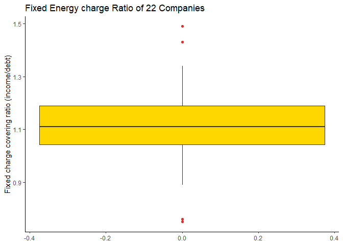
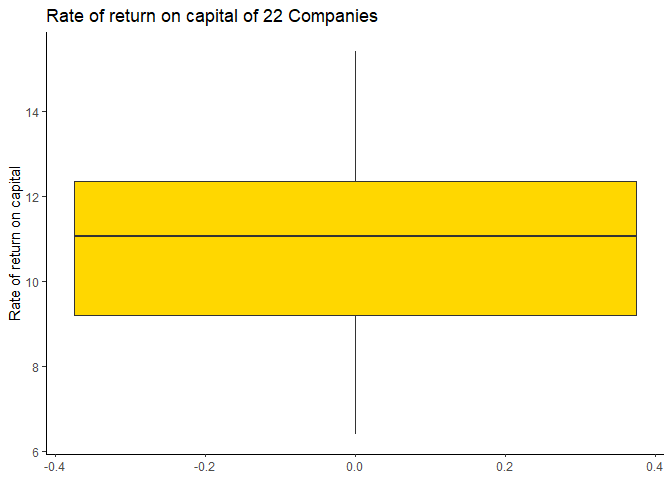
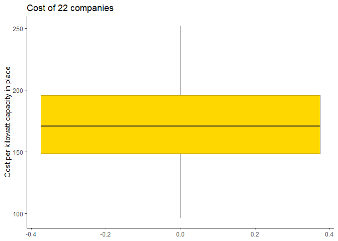
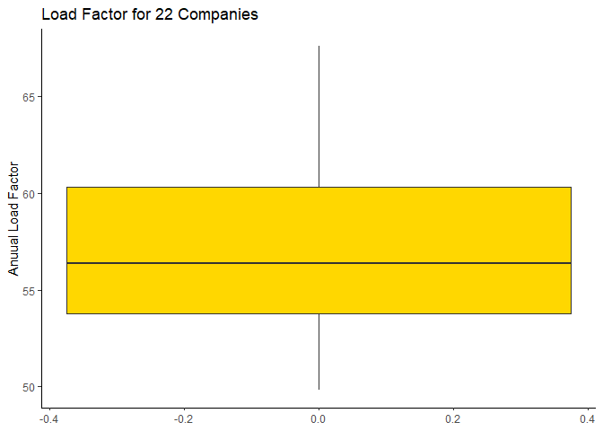
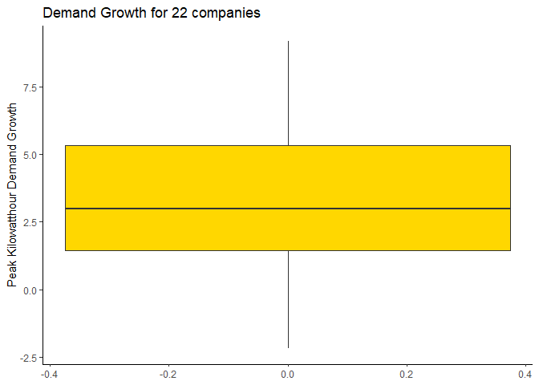
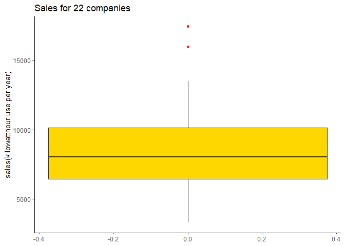
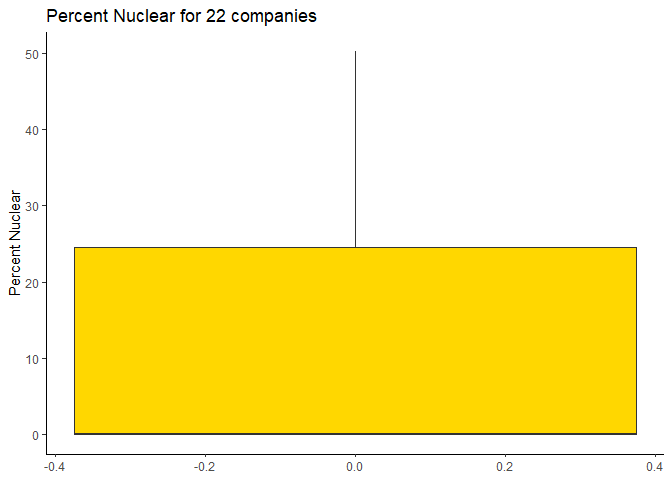
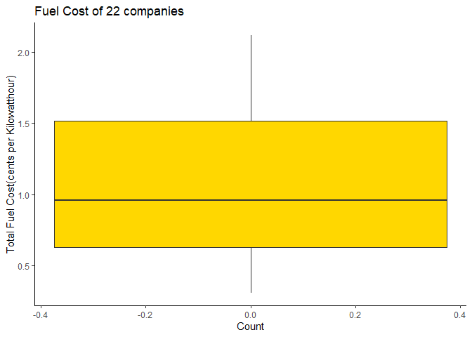
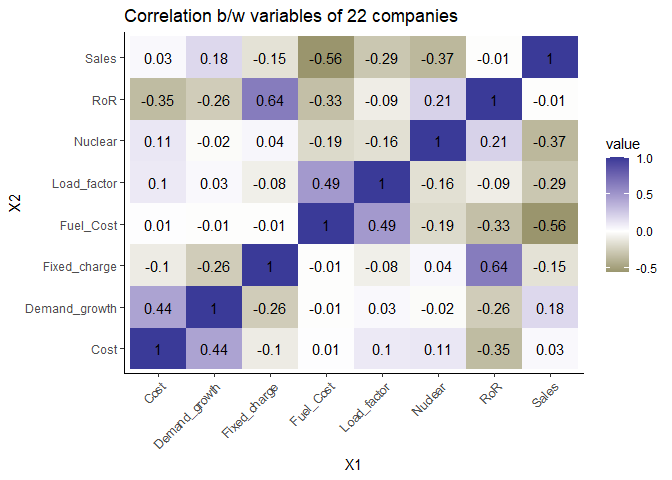

```r
knitr::opts_chunk$set(echo = TRUE)
if(!require("pacman")) install.packages("pacman")
```

```
## Loading required package: pacman
```

```r
pacman::p_load(knitr, rmarkdown, gplots, GGally, mosaic,
               scales, mosaic, mapproj, mlbench, data.table)
search()
```

```
##  [1] ".GlobalEnv"         "package:data.table" "package:mlbench"   
##  [4] "package:mapproj"    "package:maps"       "package:scales"    
##  [7] "package:mosaic"     "package:Matrix"     "package:mosaicData"
## [10] "package:ggformula"  "package:ggstance"   "package:lattice"   
## [13] "package:dplyr"      "package:GGally"     "package:ggplot2"   
## [16] "package:gplots"     "package:rmarkdown"  "package:knitr"     
## [19] "package:pacman"     "package:stats"      "package:graphics"  
## [22] "package:grDevices"  "package:utils"      "package:datasets"  
## [25] "package:methods"    "Autoloads"          "package:base"
```

```r
theme_set(theme_classic())
```


```r
##Read CSV File
library("data.table")
Utilities.df <- read.csv("Utilities.csv")
```


```r
##Setting Data table
Utilities.dt <- setDT(Utilities.df)
Utilities.dt
```

```
##          Company Fixed_charge  RoR Cost Load_factor Demand_growth Sales Nuclear
##  1:     Arizona          1.06  9.2  151        54.4           1.6  9077     0.0
##  2:      Boston          0.89 10.3  202        57.9           2.2  5088    25.3
##  3:     Central          1.43 15.4  113        53.0           3.4  9212     0.0
##  4: Commonwealth         1.02 11.2  168        56.0           0.3  6423    34.3
##  5:           NY         1.49  8.8  192        51.2           1.0  3300    15.6
##  6:     Florida          1.32 13.5  111        60.0          -2.2 11127    22.5
##  7:    Hawaiian          1.22 12.2  175        67.6           2.2  7642     0.0
##  8:        Idaho         1.10  9.2  245        57.0           3.3 13082     0.0
##  9:     Kentucky         1.34 13.0  168        60.4           7.2  8406     0.0
## 10:     Madison          1.12 12.4  197        53.0           2.7  6455    39.2
## 11:       Nevada         0.75  7.5  173        51.5           6.5 17441     0.0
## 12:  New England         1.13 10.9  178        62.0           3.7  6154     0.0
## 13:     Northern         1.15 12.7  199        53.7           6.4  7179    50.2
## 14:     Oklahoma         1.09 12.0   96        49.8           1.4  9673     0.0
## 15:     Pacific          0.96  7.6  164        62.2          -0.1  6468     0.9
## 16:        Puget         1.16  9.9  252        56.0           9.2 15991     0.0
## 17:    San Diego         0.76  6.4  136        61.9           9.0  5714     8.3
## 18:     Southern         1.05 12.6  150        56.7           2.7 10140     0.0
## 19:        Texas         1.16 11.7  104        54.0          -2.1 13507     0.0
## 20:    Wisconsin         1.20 11.8  148        59.9           3.5  7287    41.1
## 21:       United         1.04  8.6  204        61.0           3.5  6650     0.0
## 22:     Virginia         1.07  9.3  174        54.3           5.9 10093    26.6
##          Company Fixed_charge  RoR Cost Load_factor Demand_growth Sales Nuclear
##     Fuel_Cost
##  1:     0.628
##  2:     1.555
##  3:     1.058
##  4:     0.700
##  5:     2.044
##  6:     1.241
##  7:     1.652
##  8:     0.309
##  9:     0.862
## 10:     0.623
## 11:     0.768
## 12:     1.897
## 13:     0.527
## 14:     0.588
## 15:     1.400
## 16:     0.620
## 17:     1.920
## 18:     1.108
## 19:     0.636
## 20:     0.702
## 21:     2.116
## 22:     1.306
##     Fuel_Cost
```
##Answer 1

```r
##Fixed Variable
Utilities.dt[, .(minimum=min(Fixed_charge), maximum=max(Fixed_charge),mean=mean(Fixed_charge),
               median=median(Fixed_charge),sd=sd(Fixed_charge))]
```

```
##    minimum maximum     mean median        sd
## 1:    0.75    1.49 1.114091   1.11 0.1845112
```


```r
##RoR
Utilities.dt[, .(minimum=min(RoR), maximum=max(RoR),mean=mean(RoR),
                 median=median(RoR),sd=sd(RoR))]
```

```
##    minimum maximum     mean median       sd
## 1:     6.4    15.4 10.73636  11.05 2.244049
```

```r
##Cost
Utilities.dt[, .(minimum=min(Cost), maximum=max(Cost),mean=mean(Cost),
                 median=median(Cost),sd=sd(Cost))]
```

```
##    minimum maximum     mean median       sd
## 1:      96     252 168.1818  170.5 41.19135
```

```r
##Load Factor
Utilities.dt[, .(minimum=min(Load_factor), maximum=max(Load_factor),mean=mean(Load_factor),
                 median=median(Load_factor),sd=sd(Load_factor))]
```

```
##    minimum maximum     mean median       sd
## 1:    49.8    67.6 56.97727  56.35 4.461148
```

```r
##Demand Growth
Utilities.dt[, .(minimum=min(Demand_growth), maximum=max(Demand_growth),mean=mean(Demand_growth),
                 median=median(Demand_growth),sd=sd(Demand_growth))]
```

```
##    minimum maximum     mean median      sd
## 1:    -2.2     9.2 3.240909      3 3.11825
```

```r
##Sales
Utilities.dt[, .(minimum=min(Sales), maximum=max(Sales),mean=mean(Sales),
                 median=median(Sales),sd=sd(Sales))]
```

```
##    minimum maximum     mean median       sd
## 1:    3300   17441 8914.045   8024 3549.984
```

```r
##Nuclear
Utilities.dt[, .(minimum=min(Nuclear), maximum=max(Nuclear),mean=mean(Nuclear),
                 median=median(Nuclear),sd=sd(Nuclear))]
```

```
##    minimum maximum mean median       sd
## 1:       0    50.2   12      0 16.79192
```

```r
##Fuel Cost
Utilities.dt[, .(minimum=min(Fuel_Cost), maximum=max(Fuel_Cost),mean=mean(Fuel_Cost),
                 median=median(Fuel_Cost),sd=sd(Fuel_Cost))]
```

```
##    minimum maximum     mean median        sd
## 1:   0.309   2.116 1.102727   0.96 0.5560981
```

```r
##Interpretation:
##We can use standard deviation as the measure of variability. 
##From the output when we compare all the standard deviations of variables, 
##we can observe that sales have the highest variability as its standard deviation is high.
```
##Answer 2

```r
ggplot(Utilities.dt) +
  geom_boxplot(aes(y = Utilities.dt$Fixed_charge), 
               fill = "gold1", outlier.color = "firebrick2") + 
   ylab("Fixed charge covering ratio (income/debt)") + 
  ggtitle("Fixed Energy charge Ratio of 22 Companies")
```

<!-- -->

```r
#RoR

ggplot(Utilities.dt) +
  geom_boxplot(aes(y = Utilities.dt$RoR), 
               fill = "gold1", outlier.color = "firebrick2") + 
  ylab("Rate of return on capital") +
  ggtitle("Rate of return on capital of 22 Companies")
```

<!-- -->

```r
#Cost
ggplot(Utilities.dt) +
  geom_boxplot(aes(y = Utilities.dt$Cost), 
               fill = "gold1", outlier.color = "firebrick2") + 
  ylab("Cost per kilowatt capacity in place") + ggtitle("Cost of 22 companies")
```

<!-- -->

```r
#Load Factor
ggplot(Utilities.dt) +
  geom_boxplot(aes(y = Utilities.dt$Load_factor), 
               fill = "gold1", outlier.color = "firebrick2") + 
    ylab("Anuual Load Factor") + ggtitle("Load Factor for 22 Companies")
```

<!-- -->

```r
#Demand Growth
ggplot(Utilities.dt) +
  geom_boxplot(aes(y = Utilities.dt$Demand_growth), 
               fill = "gold1", outlier.color = "firebrick2") + 
    ylab("Peak Kilowatthour Demand Growth") +
  ggtitle("Demand Growth for 22 companies")
```

<!-- -->

```r
#Sales

ggplot(Utilities.dt) +
  geom_boxplot(aes(y = Utilities.dt$Sales), 
               fill = "gold1", outlier.color = "firebrick2") + 
  ylab("sales(kilowatthour use per year)") + ggtitle("Sales for 22 companies")
```

<!-- -->

```r
#Nuclear

ggplot(Utilities.dt) +
  geom_boxplot(aes(y = Utilities.dt$Nuclear), 
               fill = "gold1", outlier.color = "firebrick2") + 
   ylab("Percent Nuclear") + ggtitle("Percent Nuclear for 22 companies")
```

<!-- -->

```r
#Fuel_Cost

ggplot(Utilities.dt) +
  geom_boxplot(aes(y = Utilities.dt$Fuel_Cost), 
               fill = "gold1", outlier.color = "firebrick2") + 
  xlab("Count") + ylab("Total Fuel Cost(cents per Kilowatthour)") +
  ggtitle("Fuel Cost of 22 companies") 
```

<!-- -->

```r
##Interpretation:
##There are 8 variables in the data set out of which 2 variables have the outliers.
##Fixed charge and Sales are having extreme values(outliers).
##Fixed charge has totally 4 outliers. The outliers are on the both sides of the box plot.
##Sales has 2 outliers above the box plot
##Statistically any value (X) which satisfies the below equations is called outlier. 
##X < Q1 - 1.5 IQR or X > Q3 + 1.5 IQR where IQR is the difference between the 75th and 
##25th percentiles.
```
##Answer 3

```r
##heatmap using ggplot
library(reshape)
```

```
## Warning: package 'reshape' was built under R version 3.6.2
```

```
## 
## Attaching package: 'reshape'
```

```
## The following object is masked from 'package:data.table':
## 
##     melt
```

```
## The following object is masked from 'package:Matrix':
## 
##     expand
```

```
## The following object is masked from 'package:dplyr':
## 
##     rename
```

```r
cor.mat <- round(cor(Utilities.dt[,!c("Company")]),2)
# rounded correlation matrix
melted.cor.mat <- melt(cor.mat)
ggplot(melted.cor.mat, aes(x = X1, y = X2, fill = value)) +
  scale_fill_gradient2( low = muted("yellow"), mid = "white",
                        high = muted("blue"), midpoint = 0, space = "Lab",
                        na.value = "grey50", guide = "colourbar", aesthetics = "fill") +
  geom_tile() +  
geom_text(aes(x = X1, y = X2, label = value)) +
  theme(axis.text.x = element_text(angle = 45, hjust = 1)) +
  ggtitle("Correlation b/w variables of 22 companies")
```

<!-- -->

```r
##Interpretation:
##From the heat map it is observed that ROR and Fixed Charge are highly positively 
##Correlated variables 
##which means increase in one variable increases the other.
##Sales and Fuel Cost are highly negatively 
##correlated which means decrease in one variable increase the other variable and vice versa.
##We can see that there are many values between 
##-0.1 to 0.1 (For example: -0.01, 0.01, 0.03). 
##This shows that there is no relationship or
##very weak relationship between the variables. 
##Those variables are independent of each other and not related. 
```
##Answer 4

```r
## Principal component analysis using unscaled numeric variables in the dataset
pca_unscaled <- prcomp(na.omit(Utilities.dt[,-c(1:1)]))
summary(pca_unscaled)
```

```
## Importance of components:
##                              PC1      PC2      PC3   PC4   PC5   PC6    PC7
## Standard deviation     3549.9901 41.26913 15.49215 4.001 2.783 1.977 0.3501
## Proportion of Variance    0.9998  0.00014  0.00002 0.000 0.000 0.000 0.0000
## Cumulative Proportion     0.9998  0.99998  1.00000 1.000 1.000 1.000 1.0000
##                           PC8
## Standard deviation     0.1224
## Proportion of Variance 0.0000
## Cumulative Proportion  1.0000
```

```r
pca_unscaled$rot
```

```
##                         PC1           PC2           PC3           PC4
## Fixed_charge   7.883140e-06 -0.0004460932  0.0001146357 -0.0057978329
## RoR            6.081397e-06 -0.0186257078  0.0412535878  0.0292444838
## Cost          -3.247724e-04  0.9974928360 -0.0566502956 -0.0179103135
## Load_factor    3.618357e-04  0.0111104272 -0.0964680806  0.9930009368
## Demand_growth -1.549616e-04  0.0326730808 -0.0038575008  0.0544730799
## Sales         -9.999983e-01 -0.0002209801  0.0017377455  0.0005270008
## Nuclear        1.767632e-03  0.0589056695  0.9927317841  0.0949073699
## Fuel_Cost      8.780470e-05  0.0001659524 -0.0157634569  0.0276496391
##                         PC5           PC6           PC7           PC8
## Fixed_charge   0.0198566131 -0.0583722527 -1.002990e-01  9.930280e-01
## RoR            0.2028309717 -0.9735822744 -5.984233e-02 -6.717166e-02
## Cost           0.0355836487 -0.0144563569 -9.986723e-04 -1.312104e-03
## Load_factor    0.0495177973  0.0333700701  2.930752e-02  9.745357e-03
## Demand_growth -0.9768581322 -0.2038187556  8.898790e-03  8.784363e-03
## Sales          0.0001471164  0.0001237088 -9.721241e-05  5.226863e-06
## Nuclear       -0.0057261758  0.0430954352 -1.043775e-02  2.059461e-03
## Fuel_Cost     -0.0215054038  0.0633116915 -9.926283e-01 -9.594372e-02
```

```r
##Interpretation:
##From the generated values we can see that PC1 has 99.98% of variance which means that the data is 
##mostly dependent on PC1.
##PC1 and PC2 has almost 100% of variance where 
##PC1 accounting for the major variance in data.
##The other variables have 0 variance.
##Hence the primary focus should be on PC1.
```
##Answer 5

```r
#principal component analysis using scaled numeric variables
pcs.scaled <- prcomp(na.omit(Utilities.dt[,-c(1:1)]), scale. = T)
summary(pcs.scaled)
```

```
## Importance of components:
##                           PC1    PC2    PC3    PC4     PC5     PC6     PC7
## Standard deviation     1.4741 1.3785 1.1504 0.9984 0.80562 0.75608 0.46530
## Proportion of Variance 0.2716 0.2375 0.1654 0.1246 0.08113 0.07146 0.02706
## Cumulative Proportion  0.2716 0.5091 0.6746 0.7992 0.88031 0.95176 0.97883
##                            PC8
## Standard deviation     0.41157
## Proportion of Variance 0.02117
## Cumulative Proportion  1.00000
```

```r
pcs.scaled$rot
```

```
##                       PC1         PC2         PC3         PC4        PC5
## Fixed_charge   0.44554526 -0.23217669  0.06712849 -0.55549758  0.4008403
## RoR            0.57119021 -0.10053490  0.07123367 -0.33209594 -0.3359424
## Cost          -0.34869054  0.16130192  0.46733094 -0.40908380  0.2685680
## Load_factor   -0.28890116 -0.40918419 -0.14259793 -0.33373941 -0.6800711
## Demand_growth -0.35536100  0.28293270  0.28146360 -0.39139699 -0.1626375
## Sales          0.05383343  0.60309487 -0.33199086 -0.19086550 -0.1319721
## Nuclear        0.16797023 -0.08536118  0.73768406  0.33348714 -0.2496462
## Fuel_Cost     -0.33584032 -0.53988503 -0.13442354 -0.03960132  0.2926660
##                       PC6         PC7         PC8
## Fixed_charge  -0.00654016  0.20578234 -0.48107955
## RoR           -0.13326000 -0.15026737  0.62855128
## Cost           0.53750238 -0.11762875  0.30294347
## Load_factor    0.29890373  0.06429342 -0.24781930
## Demand_growth -0.71916993 -0.05155339 -0.12223012
## Sales          0.14953365  0.66050223  0.10339649
## Nuclear        0.02644086  0.48879175 -0.08466572
## Fuel_Cost     -0.25235278  0.48914707  0.43300956
```

```r
##Interpretation:
##After scaling we can observe that there is a difference in proportion of variance 
##among the components.
##Now the variables look distributed and each variable ##have significant impact on the data.
##Now we can’t primarily focus on PC1, we have to consider other PCs as well.Hence dependencies 
##of variables have become wide and accurate.
##The standard deviation has been changed from 
##3549.9901 to 1.4741
##Scaling helps us to standardize the input data.
```


